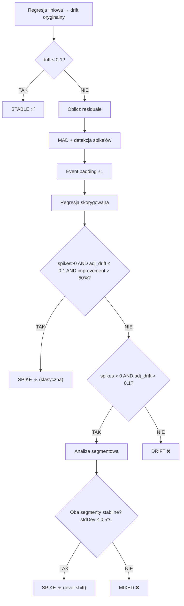

# Algorytm Stabilności i Drift vs Spike — Metoda A+ z Analizą Segmentową

> **Plik źródłowy:** `MeasurementSeriesServiceImpl.java` → metoda `calculateStatistics()`  
> **Wersja algorytmu:** 2.0 (z analizą segmentową)  
> **Data:** 2026-03-01

---

## 1. Przegląd

Algorytm przetwarza serię pomiarów temperatury i oblicza:

| Grupa | Parametry |
|-------|-----------|
| **Podstawowe** | T_min, T_max, T_avg, **T_mediana**, n, zakres czasowy, **interwał** |
| **Zaawansowane** | MKT, StdDev, Wariancja, CV%, **U (k=2)**, **P5**, **P95** |
| **Czasowe** | Czas w/poza zakresem, % w/poza zakresem, ilość przekroczeń, max czas powrotu |
| **Stabilność** | Współczynnik trendu (°C/24h), klasyfikacja STABLE/UNSTABLE |
| **Drift vs Spike** | Klasyfikacja: STABLE / SPIKE / MIXED / DRIFT |

---

## 2. Regresja Liniowa (Stabilność)

### Model
```
T(t) = a + b × t + ε
```
- `t` — czas w godzinach od pierwszego pomiaru
- `b` — współczynnik trendu (°C/godzina)
- `a` — wyraz wolny (temperatura początkowa)

### Wzór na współczynnik `b`
```
b = (n × Σ(t×T) − Σt × ΣT) / (n × Σ(t²) − (Σt)²)
```

### Kryterium stabilności
```
|b × 24| ≤ 0.1°C/24h  →  STABILNE ✅
|b × 24| > 0.1°C/24h   →  NIESTABILNE ❌
```

---

## 3. Drift vs Spike — Algorytm Metoda A+

### 3.1. Schemat blokowy



### 3.2. Krok 1: Oblicz residuale
```
residual[i] = T[i] − (a + b × t[i])
```
Odchylenia każdego pomiaru od linii regresji.

### 3.3. Krok 2: MAD (Median Absolute Deviation)
```
mediana_residuali = median(residual[])
abs_deviation[i] = |residual[i] − mediana_residuali|
MAD = median(abs_deviation[])
```

**Minimalny próg MAD:** jeśli `MAD < 0.01`, ustaw `MAD = 0.01`.

**Próg detekcji spike'ów:**
```
threshold = 3.5 × MAD
```

### 3.4. Krok 3: Detekcja spike'ów
```
Jeśli abs_deviation[i] > threshold → punkt i jest SPIKE'EM
```

### 3.5. Krok 3b: Event padding ±1
Dla każdego wykrytego spike'a, **oznacz również sąsiadów** (i−1, i+1) jako część zdarzenia:
```
padded_spikes = {}
for idx in spike_indices:
    padded_spikes += {idx-1, idx, idx+1}  (w granicach 0..n-1)
```

**Uzasadnienie:** Spike to zdarzenie fizyczne (np. otwarcie drzwi), które wpływa na sąsiednie pomiary. Padding ±1 wyłapuje fazę narastania i opadania temperatury wokół anomalii.

### 3.6. Krok 4: Regresja skorygowana
Regresja liniowa na pomiarach **bez** spike'ów (z paddingiem).
```
b_adj = regresja(punkty − padded_spikes)
adj_drift = |b_adj × 24|
improvement = (orig_drift − adj_drift) / orig_drift
```

### 3.7. Krok 5: Klasyfikacja

| Warunek | Klasyfikacja | Opis |
|---------|-------------|------|
| `orig_drift ≤ 0.1` | **STABLE** | Brak istotnego trendu |
| `spikes > 0 AND adj_drift ≤ 0.1 AND improvement > 50%` | **SPIKE** (klasyczna) | Trend znikł po usunięciu anomalii |
| `spikes > 0 AND adj_drift > 0.1` | → Analiza segmentowa | Trend utrzymuje się — sprawdź czy to level shift |
| brak spike'ów AND `orig_drift > 0.1` | **DRIFT** | Systematyczny trend temperaturowy |

### 3.8. Krok 6: Analiza segmentowa (rozstrzyganie SPIKE vs MIXED)

Uruchamiany **tylko gdy** regresja skorygowana nie wystarczyła (adj_drift > 0.1 mimo wykrytych spike'ów).

```
spike_zone = [min(padded_spikes), max(padded_spikes)]

Segment PRZED = pomiary[0 .. spike_zone.start - 1]
Segment PO    = pomiary[spike_zone.end + 1 .. n-1]

stdDev_przed = odchylenie_standardowe(Segment PRZED)
stdDev_po    = odchylenie_standardowe(Segment PO)
```

**Kryterium stabilności segmentu:** `stdDev ≤ 0.5°C`

| Wynik | Klasyfikacja |
|-------|-------------|
| Oba segmenty stabilne (lub za krótkie < 3 pkt) | **SPIKE** (level shift) |
| Którykolwiek segment niestabilny | **MIXED** |

**Logika:** Jeśli temperatura przed i po spike'u jest "spokojnie stała" (mała wariancja), to trend globalny wynika z **przesunięcia poziomu** po zdarzeniu jednorazowym — nie z systematycznego dryfu.

---

## 4. Stałe algorytmu

| Stała | Wartość | Zastosowanie |
|-------|---------|-------------|
| `MAD_MIN` | 0.01°C | Minimalny próg MAD (czułość w stabilnych środowiskach) |
| `MAD_MULTIPLIER` | 3.5 | Mnożnik MAD → próg detekcji spike'ów (~3σ) |
| `DRIFT_THRESHOLD` | 0.1°C/24h | Granica stabilności trendu |
| `IMPROVEMENT_THRESHOLD` | 50% | Minimalna poprawa trendu po usunięciu spike'ów |
| `SEGMENT_STDDEV_MAX` | 0.5°C | Maksymalne odchylenie standardowe w segmencie |
| `MIN_POINTS` | 6 | Minimalna liczba pomiarów do analizy |
| `EVENT_PADDING` | ±1 punkt | Rozszerzenie strefy spike'a |

---

## 5. MKT (Mean Kinetic Temperature)

### Wzór
```
MKT = (ΔH/R) / (−ln((1/n) × Σ exp(−ΔH/(R × T_K[i])))) − 273.15
```

- `ΔH` — energia aktywacji (domyślnie 83.14 kJ/mol, pobierana z MaterialType)
- `R` = 8.314472 J/(mol·K) — stała gazowa
- `T_K[i]` = T[i] + 273.15 — temperatura w Kelvinach

---

## 6. Mediana, Niepewność Rozszerzona, Percentyle

### Mediana
Bardziej robustna miara tendencji centralnej niż średnia — odporna na outlier'y.
```
Mediana = sortedTemps[n/2]          (n nieparzyste)
Mediana = (sortedTemps[n/2-1] + sortedTemps[n/2]) / 2  (n parzyste)
```

### Niepewność rozszerzona U
```
U = k × σ   (k=2, poziom ufności 95%)
```
Wynik oznacza: temperatura ± U obejmuje 95% pomiarów.

### Percentyle P5 i P95 (interpolacja liniowa)
```
rank = (percentile / 100) × (n − 1)
lower = floor(rank)
upper = ceil(rank)
fraction = rank − lower

P = sortedTemps[lower] + fraction × (sortedTemps[upper] − sortedTemps[lower])
```
P5/P95 wyznaczają zakres 90% pomiarów — niezależny od ekstremalnych outlier'ów.

### Interwał pomiarowy
```
interval = Duration.between(pomiar[0], pomiar[1]).toMinutes()
```

---

## 7. Statystyki czasowe

Obliczane **tylko gdy** urządzenie ma zdefiniowany zakres operacyjny (`minOperatingTemp`, `maxOperatingTemp`).

```
Czas interwału = Duration.between(pomiar[i], pomiar[i+1])

Jeśli T[i] < minLimit LUB T[i] > maxLimit:
    → timeOut += interwał
    → jeśli nowe naruszenie: violations++
W przeciwnym razie:
    → timeIn += interwał
    → jeśli koniec naruszenia: finalizuj max_violation_duration
```

---

## 8. Przykład klasyfikacji — dane użytkownika

### Dane: 40 pomiarów, 3h interwał, 117h
```
Segment PRZED (14 pkt): avg=4.61°C, stdDev=0.234°C
Spike zone (5 pkt):     4.7, 4.0, 5.2, 6.1, 5.4°C
Segment PO (21 pkt):    avg=5.14°C, stdDev=0.224°C
```

### Ścieżka algorytmu
1. Regresja → drift = 0.123°C/24h > 0.1 → **NIESTABILNE**
2. MAD = 0.262, threshold = 0.917 → 2 spike'i (pkt 16, 18)
3. Padding ±1 → 5 punktów (pkt 15-19)
4. Regresja skorygowana → adj_drift = 0.123 > 0.1, improvement ≈ 0%
5. **Analiza segmentowa:**
   - stdDev_PRZED = 0.234 ≤ 0.5 ✅
   - stdDev_PO = 0.224 ≤ 0.5 ✅
6. **Klasyfikacja: SPIKE** (level shift +0.52°C po zdarzeniu)
