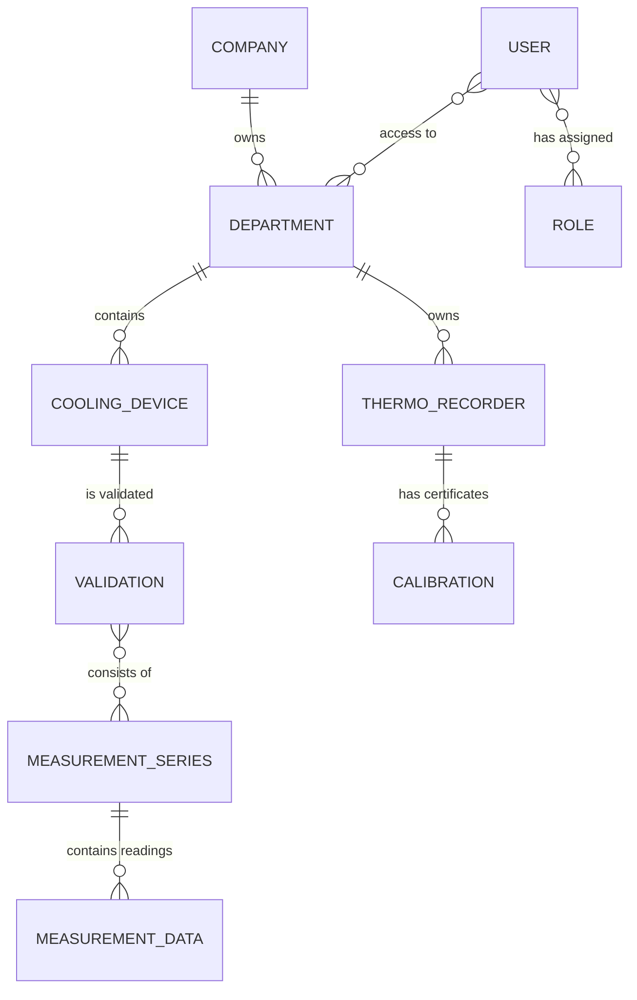

# Data Dictionary & Relational Model: Validation Cold Control (VCC)

## 1. ERD (Entity Relationship Diagram)

---

## 2. Database Table Descriptions

### 2.1 Table: `companies`
Represents the primary logic level for multi-tenancy.
- `id` (PK): Unique company identifier.
- `name`: Full organization name.
- `address`: Registered address.
- `created_date`: Date the company was registered in the system.

### 2.2 Table: `users`
Stores access and profile data for employees.
- `id` (PK): Unique identifier.
- `username`: Login (unique).
- `email`: Email address (unique).
- `password`: Password hash (BCrypt).
- `password_expires_at`: Expiration date of the current password.
- `permissions_cache_json`: Permissions stored in JSON format (performance optimization).

### 2.3 Table: `cooling_devices`
Registry of devices subject to validation.
- `inventory_number`: Inventory number (business key).
- `name`: Common name.
- `department_id` (FK): Association with a department.
- `chamber_type`: Chamber type (e.g., fridge, freezer, incubator).
- `volume`: Volume in m³.

### 2.4 Table: `thermo_recorders`
Temperature loggers used for measurements.
- `serial_number`: Manufacturer serial number.
- `model`: Device model (e.g., Testo, LogTag).
- `resolution`: Measurement resolution (critical for uncertainty calculations).

### 2.5 Table: `validations`
History and results of validation processes.
- `cooling_device_id` (FK): Reference to the device.
- `status`: Process state (Draft, Completed, Approved).
- `validation_plan_number`: Number from the annual validation plan.
- `average_device_temperature`: Resulting statistical parameter.

---

## 3. Audit & Versioning (Envers)
All business tables have corresponding tables with the `_AUD` suffix (e.g., `validations_AUD`). They store the history of every change along with:
- `REV`: Revision number.
- `REVTYPE`: Change type (0-ADD, 1-MOD, 2-DEL).
- `MODIFIED_BY`: ID of the user performing the change.
