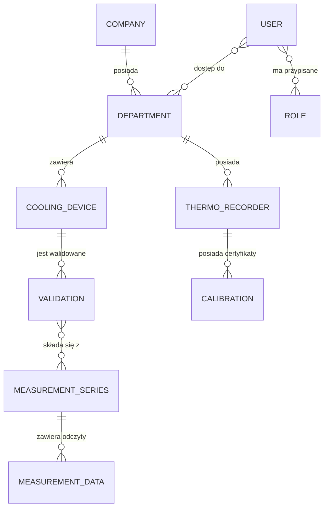

# Słownik Danych i Model Relacyjny: Validation Cold Control (VCC)

## 1. Diagram ERD (Entity Relationship Diagram)

---

## 2. Opis tabel bazy danych

### 2.1 Tabela: `companies`
Reprezentuje główny poziom multi-tenancy.
- `id` (PK): Unikalny identyfikator firmy.
- `name`: Pełna nazwa organizacji.
- `address`: Adres siedziby.
- `created_date`: Data rejestracji firmy w systemie.

### 2.2 Tabela: `users`
Przechowuje dane dostępowe i profilowe pracowników.
- `id` (PK): Unikalny identyfikator.
- `username`: Login (unikalny).
- `email`: Adres e-mail (unikalny).
- `password`: Hash hasła (BCrypt).
- `password_expires_at`: Data wygaśnięcia obecnego hasła.
- `permissions_cache_json`: Składowane w formacie JSON uprawnienia (optymalizacja wydajności).

### 2.3 Tabela: `cooling_devices`
Ewidencja urządzeń podlegających walidacji.
- `inventory_number`: Numer inwentarzowy (klucz biznesowy).
- `name`: Nazwa własna.
- `department_id` (FK): Powiązanie z działem.
- `chamber_type`: Typ komory (np. lodówka, zamrażarka, inkubator).
- `volume`: Objętość w m³.

### 2.4 Tabela: `thermo_recorders`
Rejestratury temperatury używane do pomiarów.
- `serial_number`: Numer seryjny producenta.
- `model`: Model urządzenia (np. Testo, LogTag).
- `resolution`: Rozdzielczość pomiarowa (istotna do obliczeń niepewności).

### 2.5 Tabela: `validations`
Historia i wyniki procesów walidacyjnych.
- `cooling_device_id` (FK): Referencja do urządzenia.
- `status`: Stan procesu (Draft, Completed, Approved).
- `validation_plan_number`: Numer z rocznego planu walidacji.
- `average_device_temperature`: Wynikowy parametr statystyczny.

---

## 3. Audyt i Wersjonowanie (Envers)
Wszystkie tabele biznesowe posiadają odpowiadające im tabele z sufiksem `_AUD` (np. `validations_AUD`). Przechowują one historię każdej zmiany wraz z informacją:
- `REV`: Numer rewizji.
- `REVTYPE`: Typ zmiany (0-ADD, 1-MOD, 2-DEL).
- `MODIFIED_BY`: Id użytkownika dokonującego zmiany.
